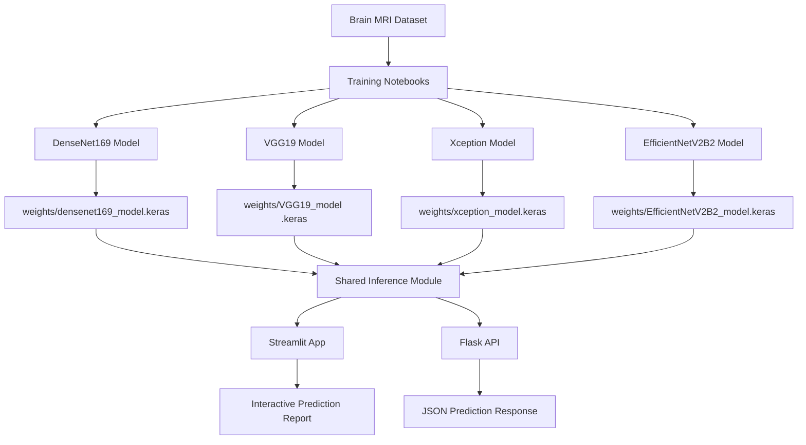
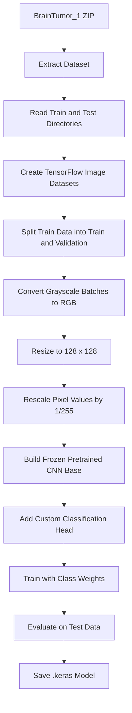
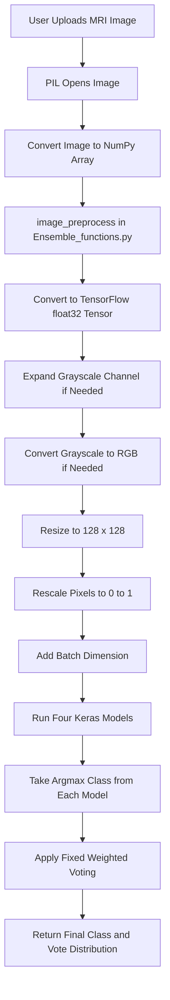
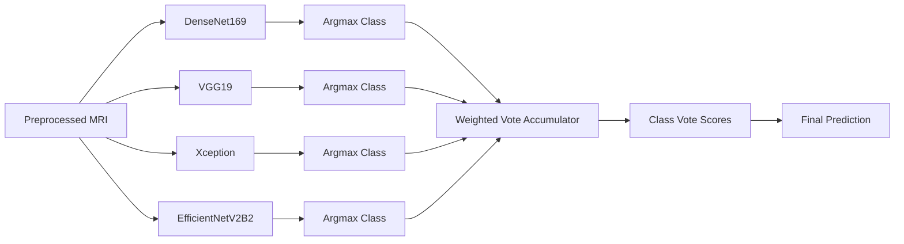
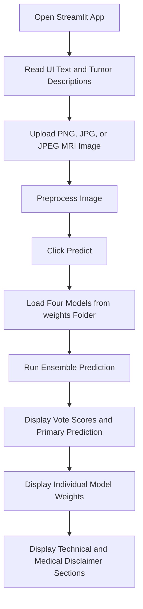
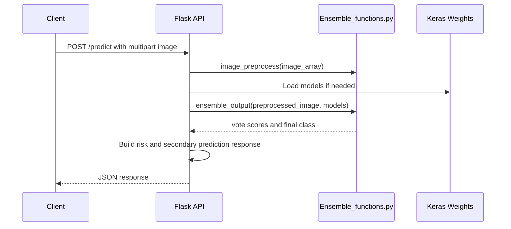

# Brain Tumor Image Classification App

This repository contains a deep learning project for classifying brain MRI images into four classes: Glioma, Meningioma, No Tumour, and Pituitary Tumor. It includes training notebooks, saved Keras model weights, a Streamlit web application, and a Flask API. The final prediction is produced by an ensemble of four convolutional neural network models.

The project is intended for educational and screening-support use. It is not a medical diagnostic device and must not be used as a replacement for review by qualified medical professionals.

## Table of Contents

- [Project Overview](#project-overview)
- [Prediction Classes](#prediction-classes)
- [High-Level Architecture](#high-level-architecture)
- [Repository Structure](#repository-structure)
- [Dataset Details](#dataset-details)
- [Training Pipeline](#training-pipeline)
- [Model Architectures](#model-architectures)
- [Evaluation Results](#evaluation-results)
- [Inference Pipeline](#inference-pipeline)
- [Ensemble Voting Logic](#ensemble-voting-logic)
- [Streamlit Application](#streamlit-application)
- [Flask API](#flask-api)
- [Setup and Installation](#setup-and-installation)
- [Running the Project](#running-the-project)
- [Model Weights](#model-weights)
- [Important Implementation Notes](#important-implementation-notes)
- [Limitations](#limitations)
- [Future Improvements](#future-improvements)
- [Troubleshooting](#troubleshooting)

## Project Overview

The project analyzes an uploaded brain MRI image and predicts one of four categories. It does this by preprocessing the image, sending it through four independently trained CNN models, and combining the models' class predictions with fixed weighted voting.

Main components:

- `App.py` provides the Streamlit user interface.
- `api.py` provides a Flask API for HTTP clients.
- `Ensemble_functions.py` contains shared preprocessing, model loading, and ensemble logic.
- `notebooks/` contains training notebooks for all four models.
- `weights/` contains the saved `.keras` model files used during inference.

The original README listed this hosted Streamlit app:

```text
https://brain-tumour-image-classification-application-210924.streamlit.app/
```

Availability of the hosted app depends on the deployment environment and model file access.

## Prediction Classes

| Class | Meaning |
| --- | --- |
| Glioma | Tumor originating from glial cells in the brain or spinal cord. |
| Meningioma | Tumor that develops in the meninges, the protective layers around the brain and spinal cord. |
| No Tumour | MRI scan is classified as showing no tumor by the model ensemble. |
| Pituitary | Tumor in or around the pituitary gland. |

The training notebooks use lowercase folder names:

```text
glioma
meningioma
notumor
pituitary
```

The deployed inference code maps predictions to:

```text
Glioma
Meningioma
No Tumour
Pituitary
```

## High-Level Architecture



The repository supports two runtime surfaces:

- Streamlit UI for manual image upload and detailed visual reporting.
- Flask API for programmatic prediction requests.

Both runtime surfaces depend on the same model weights and shared ensemble helper functions.

## Repository Structure

| Path | Type | Purpose |
| --- | --- | --- |
| `App.py` | Streamlit app | Main interactive web app for uploading MRI images, running the ensemble, and displaying analysis sections. |
| `api.py` | Flask app | REST API with `/health` and `/predict` endpoints. |
| `Ensemble_functions.py` | Shared Python module | Image preprocessing, model loading, hard-label weighted voting, and final label selection. |
| `download_models.py` | Utility script | Downloads model files from Google Drive using `gdown`. |
| `requirements.txt` | Dependency file | Packages for the Streamlit app. |
| `requirements_api.txt` | Dependency file | Packages for the Flask API deployment. |
| `PROJECT_WALKTHROUGH.md` | Documentation | Beginner-friendly explanation of the project, workflow, and concepts. |
| `README.md` | Documentation | Main project documentation. |
| `.gitattributes` | Git config | Enables automatic line-ending normalization. |
| `notebooks/Densenet169_Brain_Tumour_Classification.ipynb` | Notebook | Trains and evaluates the DenseNet169 model. |
| `notebooks/Brain_Tumour_Classification_VGG19.ipynb` | Notebook | Trains and evaluates the VGG19 model. |
| `notebooks/Xception_brain_tumour_classification.ipynb` | Notebook | Trains and evaluates the Xception model. |
| `notebooks/Brain_Tumour_Classification_EfficientNetV2B2.ipynb` | Notebook | Trains and evaluates the EfficientNetV2B2 model. |
| `weights/densenet169_model.keras` | Model artifact | Saved DenseNet169 model used by the app and API. |
| `weights/VGG19_model .keras` | Model artifact | Saved VGG19 model used by the app and API. The filename includes a space before `.keras`. |
| `weights/xception_model.keras` | Model artifact | Saved Xception model used by the app and API. |
| `weights/EfficientNetV2B2_model.keras` | Model artifact | Saved EfficientNetV2B2 model used by the app and API. |
| `weights/a.txt` | Placeholder file | Empty placeholder file in the weights folder. |
| `.ipynb_checkpoints/` | Generated folder | Jupyter checkpoint copies of root files. Not required for running the app. |
| `notebooks/.ipynb_checkpoints/` | Generated folder | Jupyter checkpoint copies of notebooks. Not required for running the app. |
| `__pycache__/` | Generated folder | Python bytecode cache. Not required for source understanding or deployment. |

## Dataset Details

The project documentation references these dataset sources:

- Original dataset: [Kaggle Brain Tumor MRI Dataset](https://www.kaggle.com/datasets/masoudnickparvar/brain-tumor-mri-dataset)
- Modified and augmented dataset: [Kaggle Brain Tumour Classification Dataset](https://www.kaggle.com/datasets/rishiksaisanthosh/brain-tumour-classification/data)

The notebooks train from a prepared `BrainTumor_1` dataset folder:

```text
BrainTumor_1/
  Train/
    glioma/
    meningioma/
    notumor/
    pituitary/
  Test/
    glioma/
    meningioma/
    notumor/
    pituitary/
```

Dataset size observed in the notebooks:

| Split | Images |
| --- | ---: |
| Full training source before validation split | 22,848 |
| Training subset | 18,279 |
| Validation subset | 4,569 |
| Test set | 1,311 |

Training subset class counts:

| Class | Training Images |
| --- | ---: |
| Glioma | 4,230 |
| Meningioma | 4,332 |
| No Tumor | 5,098 |
| Pituitary | 4,619 |
| Total | 18,279 |

Class weights used in notebooks:

| Class | Weight |
| --- | ---: |
| Glioma | 1.080319 |
| Meningioma | 1.054882 |
| No Tumor | 0.896381 |
| Pituitary | 0.989338 |

The original README says the modified dataset includes augmentation such as horizontal flip, vertical flip, and rotation. The notebooks consume the prepared dataset and do not perform additional in-notebook augmentation beyond preprocessing.

## Training Pipeline



Common notebook training settings:

| Setting | Value |
| --- | --- |
| Image loader | `tensorflow.keras.preprocessing.image_dataset_from_directory` |
| Label mode | `int` |
| Initial color mode | `grayscale` |
| Converted model input color | RGB |
| Image size | `128 x 128` |
| Batch size | `32` |
| Validation split | `0.2` |
| Random seed | `42` |
| Loss | `sparse_categorical_crossentropy` |
| Output activation | `softmax` |
| Output units | `4` |
| Epochs | `25` |
| Main callbacks | `ReduceLROnPlateau`, `ModelCheckpoint`, `CSVLogger` |

The notebooks define or use class weights to reduce class imbalance effects during training.

## Model Architectures

All four models use pretrained Keras application backbones with `include_top=False`, freeze the base model, and add a custom classification head for four classes.

### DenseNet169

Notebook:

```text
notebooks/Densenet169_Brain_Tumour_Classification.ipynb
```

Architecture summary:

- Base model: `DenseNet169(include_top=False)`
- Base trainable flag: `False`
- Input shape: `128 x 128 x 3`
- Preprocessing: `tf.keras.applications.densenet.preprocess_input`
- Pooling: `GlobalAveragePooling2D`
- Dense head: `Dense(128)`, batch normalization, ReLU, `Dense(64)`, batch normalization, ReLU
- Dropout: `0.6`
- Output: `Dense(4, activation="softmax")`
- Optimizer: `Adam(1e-4)`
- Saved model: `densenet169_model.keras`

### VGG19

Notebook:

```text
notebooks/Brain_Tumour_Classification_VGG19.ipynb
```

Architecture summary:

- Base model: `VGG19(include_top=False)`
- Base trainable flag: `False`
- Input shape: `128 x 128 x 3`
- Notebook includes VGG19 preprocessing call, then passes model input to the base model
- Pooling: `GlobalAvgPool2D`
- Dense head: `Dense(128)`, batch normalization, ReLU
- Dropout: `0.5`
- Output: `Dense(4, activation="softmax")`
- Optimizer: `Adam(learning_rate=0.0001)`
- Saved model in notebook: `VGG19_model.keras`
- Saved model expected by app/API: `VGG19_model .keras`

### Xception

Notebook:

```text
notebooks/Xception_brain_tumour_classification.ipynb
```

Architecture summary:

- Base model: `Xception(include_top=False)`
- Base trainable flag: `False`
- Input shape: `128 x 128 x 3`
- Preprocessing: `tf.keras.applications.xception.preprocess_input`
- Pooling: `GlobalAveragePooling2D`
- Dense head: `Dense(256)`, batch normalization, ReLU, `Dense(128)`, batch normalization, ReLU, `Dense(64)`, batch normalization, ReLU
- Dropout: `0.7`
- Output: `Dense(4, activation="softmax")`
- Optimizer: `Adam(1e-4)`
- Saved model: `xception_model.keras`

### EfficientNetV2B2

Notebook:

```text
notebooks/Brain_Tumour_Classification_EfficientNetV2B2.ipynb
```

Architecture summary:

- Base model: `EfficientNetV2B2(include_top=False)`
- Base trainable flag: `False`
- Input shape: `128 x 128 x 3`
- Notebook includes EfficientNetV2 preprocessing call
- Pooling: `GlobalAvgPool2D`
- Dense head: `Dense(1024, kernel_regularizer="l2")`, `Dense(512, kernel_regularizer="l2")`, `Dense(256, kernel_regularizer="l2")`, batch normalization, ReLU
- Dropout: `0.6`
- Output: `Dense(4, activation="softmax")`
- Optimizer: `Adam()`
- Saved model: `EfficientNetV2B2_model.keras`

## Evaluation Results

The notebooks evaluate each model on the 1,311-image test set.

| Model | Test Accuracy | Macro F1 Score |
| --- | ---: | ---: |
| DenseNet169 | 97.86% | 97.76% |
| VGG19 | 98.25% | 98.12% |
| Xception | 97.64% | 97.56% |
| EfficientNetV2B2 | 98.25% | 98.13% |

Class order for the confusion matrices:

```text
Glioma, Meningioma, No Tumor, Pituitary
```

### DenseNet169 Confusion Matrix

| Actual / Predicted | Glioma | Meningioma | No Tumor | Pituitary |
| --- | ---: | ---: | ---: | ---: |
| Glioma | 281 | 16 | 2 | 1 |
| Meningioma | 1 | 300 | 4 | 1 |
| No Tumor | 0 | 1 | 404 | 0 |
| Pituitary | 0 | 2 | 0 | 298 |

### VGG19 Confusion Matrix

| Actual / Predicted | Glioma | Meningioma | No Tumor | Pituitary |
| --- | ---: | ---: | ---: | ---: |
| Glioma | 290 | 9 | 0 | 1 |
| Meningioma | 5 | 296 | 1 | 4 |
| No Tumor | 0 | 1 | 404 | 0 |
| Pituitary | 0 | 2 | 0 | 298 |

### Xception Confusion Matrix

| Actual / Predicted | Glioma | Meningioma | No Tumor | Pituitary |
| --- | ---: | ---: | ---: | ---: |
| Glioma | 288 | 10 | 0 | 2 |
| Meningioma | 4 | 295 | 4 | 3 |
| No Tumor | 3 | 3 | 399 | 0 |
| Pituitary | 0 | 1 | 1 | 298 |

### EfficientNetV2B2 Confusion Matrix

| Actual / Predicted | Glioma | Meningioma | No Tumor | Pituitary |
| --- | ---: | ---: | ---: | ---: |
| Glioma | 290 | 10 | 0 | 0 |
| Meningioma | 6 | 297 | 0 | 3 |
| No Tumor | 0 | 2 | 403 | 0 |
| Pituitary | 0 | 2 | 0 | 298 |

## Inference Pipeline



The deployed inference preprocessing happens in `image_preprocess(image)`:

1. Convert the input image array to a TensorFlow `float32` tensor.
2. If the image is two-dimensional, add a channel dimension.
3. If the image has one channel, convert it to RGB.
4. Resize to `128 x 128`.
5. Rescale pixel values with `1.0 / 255.0`.
6. Return the preprocessed image without a batch dimension.

The batch dimension is added later in `ensemble_output`.

## Ensemble Voting Logic

The project does not average the full softmax probability vectors. Instead, each model first selects one class with `argmax`, then the selected classes are combined with fixed model weights.



Model voting weights from `Ensemble_functions.py`:

| Model | Weight |
| --- | ---: |
| DenseNet169 | 0.2557384390257846 |
| VGG19 | 0.25118489053640114 |
| Xception | 0.2428057094724688 |
| EfficientNetV2B2 | 0.2502709609653457 |

The weights sum to approximately `1.0`. The final output array has one score per class. These scores are best interpreted as weighted vote shares, not calibrated medical probabilities.

Example:

| Model | Predicted Class | Weight |
| --- | --- | ---: |
| DenseNet169 | Glioma | 0.255738 |
| VGG19 | Glioma | 0.251185 |
| Xception | Meningioma | 0.242806 |
| EfficientNetV2B2 | Glioma | 0.250271 |

Final weighted vote:

| Class | Vote Score |
| --- | ---: |
| Glioma | 0.757194 |
| Meningioma | 0.242806 |
| No Tumour | 0.000000 |
| Pituitary | 0.000000 |

Final prediction: `Glioma`.

## Streamlit Application

The Streamlit app is implemented in `App.py`.

Main responsibilities:

- Configure a wide Streamlit layout.
- Display project title and class descriptions.
- Accept an uploaded MRI image with `st.file_uploader`.
- Display the preprocessed image.
- Load all four models from `weights/`.
- Run `ensemble_output`.
- Display weighted vote scores, model weight information, and final prediction.
- Compute additional metrics such as entropy, certainty, and confidence margin.
- Show tumor-specific information and recommended next steps.
- Show a medical disclaimer.

Streamlit flow:



The app loads models after the `Predict` button is clicked. Because all four model files are large, loading may take time, especially on CPU-only systems.

## Flask API

The Flask API is implemented in `api.py`.

Runtime behavior:

- Creates a Flask application.
- Enables CORS for all routes.
- Keeps a global `models` variable for cached model loading.
- Loads all models on startup when the file is run directly.
- Lazily loads models inside `/predict` if they are not already loaded.
- Reuses `image_preprocess` and `ensemble_output`.

API architecture:



Endpoints:

| Endpoint | Method | Purpose |
| --- | --- | --- |
| `/health` | `GET` | Returns API health status and whether models are loaded. |
| `/predict` | `POST` | Accepts an image file under form field `image` and returns prediction JSON. |

Example `/health` response:

```json
{
  "status": "healthy",
  "models_loaded": true
}
```

Example `/predict` response shape:

```json
{
  "prediction": {
    "class": "Glioma",
    "confidence": 0.757194,
    "probabilities": {
      "Glioma": 0.757194,
      "Meningioma": 0.242806,
      "No Tumour": 0.0,
      "Pituitary": 0.0
    }
  },
  "risk_assessment": {
    "stage": "Potentially Intermediate (II-III)",
    "risk_level": "Moderate to High",
    "progression_risk": 0.9086328,
    "intervention_urgency": "High"
  },
  "secondary_prediction": {
    "class": "Meningioma",
    "confidence": 0.242806
  },
  "temporal_predictions": {
    "timeline": {
      "3-6 months": "Potential significant growth and symptom intensification",
      "6-12 months": "Risk of increased intracranial pressure",
      "beyond_12_months": "Risk of substantial neurological impact"
    },
    "monitoring": [
      "MRI follow-up every 2-3 months initially",
      "Monthly clinical evaluations",
      "Regular neurological assessments"
    ]
  }
}
```

The values above are an example of the response structure. Actual values depend on the uploaded image and model votes.

## Setup and Installation

Recommended Python version:

```text
Python 3.11
```

TensorFlow is the limiting dependency for deployment. This project pins `tensorflow==2.13.1`, which has Linux wheels for Python 3.11 but not Python 3.14. If Streamlit Community Cloud logs show `Using Python 3.14.5 environment`, dependency installation will fail before the app starts.

Create and activate a virtual environment on Windows PowerShell:

```powershell
python -m venv .venv
.\.venv\Scripts\Activate.ps1
python -m pip install --upgrade pip
```

Install Streamlit app dependencies:

```powershell
python -m pip install -r requirements.txt
```

Install Flask API dependencies:

```powershell
python -m pip install -r requirements_api.txt
```

## Running the Project

### Run the Streamlit App

```powershell
streamlit run App.py
```

Streamlit usually serves the app at:

```text
http://localhost:8501
```

### Run the Flask API

```powershell
python api.py
```

The API runs on:

```text
http://0.0.0.0:5000
```

For local testing, use:

```text
http://127.0.0.1:5000
```

Health check:

```powershell
curl http://127.0.0.1:5000/health
```

Prediction request:

```powershell
curl -X POST -F "image=@path\to\brain_mri.jpg" http://127.0.0.1:5000/predict
```

Replace `path\to\brain_mri.jpg` with the actual path to an MRI image.

## Model Weights

The current repository includes the saved model files in `weights/`.

| File | Model | Approximate Size |
| --- | --- | ---: |
| `weights/densenet169_model.keras` | DenseNet169 | 229.79 MiB |
| `weights/VGG19_model .keras` | VGG19 | 212.30 MiB |
| `weights/xception_model.keras` | Xception | 255.97 MiB |
| `weights/EfficientNetV2B2_model.keras` | EfficientNetV2B2 | 123.15 MiB |

The expected inference paths are hardcoded in both `App.py` and `api.py`:

```text
weights/densenet169_model.keras
weights/VGG19_model .keras
weights/xception_model.keras
weights/EfficientNetV2B2_model.keras
```

The VGG19 filename contains a space before `.keras`. This is important.

The `download_models.py` script downloads these Google Drive IDs:

| Download Filename in Script | Google Drive File ID |
| --- | --- |
| `densenet169_model.keras` | `1alRU89gEjm1hc1TJZ965Sg40gJrXap5g` |
| `VGG19_model.keras` | `1E_qVWwNkDj-vbYO0Rlx4JoexCxGtIw9_` |
| `xception_model.keras` | `1YMo2BkbuqCwoRi6-XfT0P5SIWyf82VEE` |
| `EfficientNetV2B2_model.keras` | `1xsk9pUCAQuztZyaa5UJwAq4cwxChUIfl` |

If you use `download_models.py`, note that the script downloads `VGG19_model.keras` without the space, while the app and API expect `VGG19_model .keras` with the space. Rename the downloaded VGG19 file or update the code paths.

PowerShell rename command:

```powershell
Rename-Item -LiteralPath "weights\VGG19_model.keras" -NewName "VGG19_model .keras"
```

## Important Implementation Notes

- The ensemble output is based on hard class votes, not averaged softmax probabilities.
- The app and API display vote scores as confidence-like values, but these are not calibrated clinical probabilities.
- The API risk assessment and temporal predictions are rule-based heuristics derived from the predicted class and vote score.
- The model does not localize tumors or produce heatmaps.
- The app should be used only with brain MRI images similar to the training data distribution.
- The Streamlit app expects the user to upload an image before pressing `Predict`.
- The Flask API expects multipart form data with the file field named `image`.
- The model files are large, so cold starts can be slow.
- The notebooks may contain Jupyter output artifacts and checkpoint copies that are not required for runtime.

## Limitations

This project has important limitations:

- It is not a final medical diagnosis.
- It only predicts one of four classes.
- It does not estimate tumor size, exact tumor location, segmentation mask, or treatment plan.
- It does not provide model explainability such as Grad-CAM.
- It may perform poorly on MRI images that differ from the training dataset.
- It depends on the quality, balance, and labeling accuracy of the original datasets.
- Vote scores are not calibrated probabilities.
- The rule-based stage and progression text should not be treated as clinical staging.
- All outputs must be reviewed by qualified healthcare professionals.

## Future Improvements

Potential improvements:

- Add Grad-CAM or similar heatmaps to explain model focus areas.
- Calibrate model probabilities using validation data.
- Average full softmax probability vectors instead of only hard argmax votes.
- Add model caching to the Streamlit app to reduce repeated load time.
- Standardize the VGG19 filename and download script path.
- Add automated tests for preprocessing, model loading, API responses, and ensemble voting.
- Add upload validation for file type, image dimensions, and empty submissions.
- Add Docker support for reproducible deployment.
- Add a PDF report export feature.
- Add a frontend client for the Flask API.
- Add model cards and dataset cards for clearer ML governance.

## Troubleshooting

### Model files not found

Check that all four expected files exist in `weights/` and that the VGG19 filename includes the space:

```text
VGG19_model .keras
```

### Slow prediction

The app loads four large TensorFlow models. CPU-only machines may take time to load and run inference.

### TensorFlow or NumPy installation errors

If using `requirements_api.txt`, TensorFlow 2.15 may not work with `numpy==2.3.2`. Use a TensorFlow-compatible NumPy version if import errors occur.

### API returns `No image provided`

Send the uploaded file with form field name `image`:

```powershell
curl -X POST -F "image=@path\to\brain_mri.jpg" http://127.0.0.1:5000/predict
```

### Streamlit prediction fails before upload

Upload a supported image file first. The accepted extensions are:

```text
png
jpg
jpeg
```
